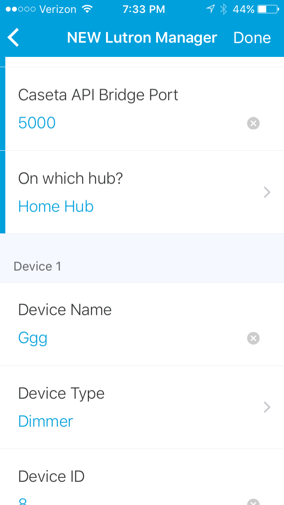
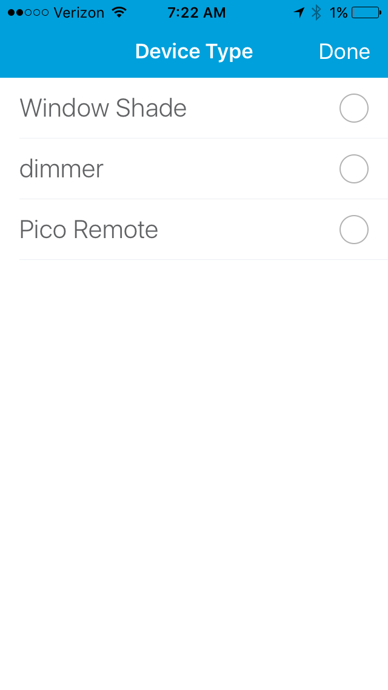
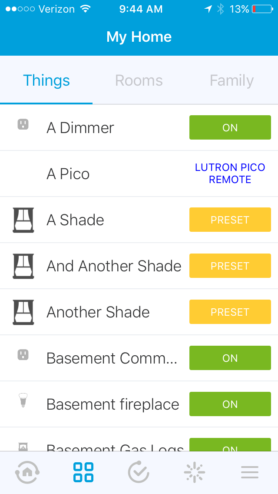
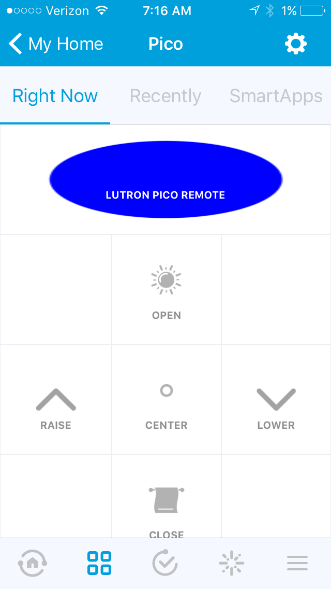

# SmartThingsPublic

This is a repository for of the Smartthings SmartApps and Device Types

## Lutron Integration

**NOTE:** This integration requires additional hardware, details will be added in the future

### Screenshots
* Setup Wizard
    

* Device Types
    

* Things View
    

* Pico Remotes!!
    pdate

## Components

### Lutron Manager

  - A Service manager for interacting with Lutron controllers including Caseta, RadioRA, and others
  
### Lutron Device Types

  - Dimmer
  - Pico Remote
  - Rollershade
  
